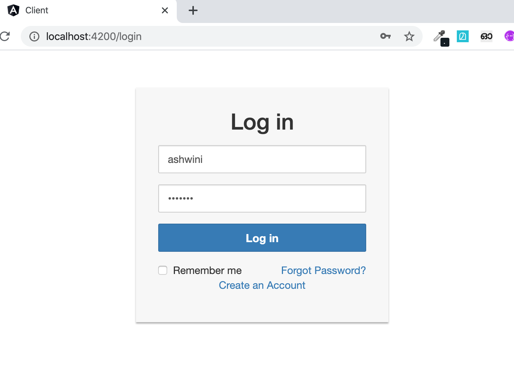
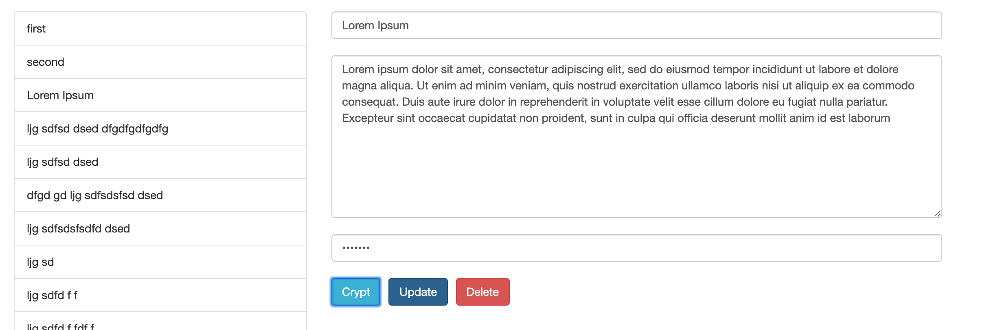
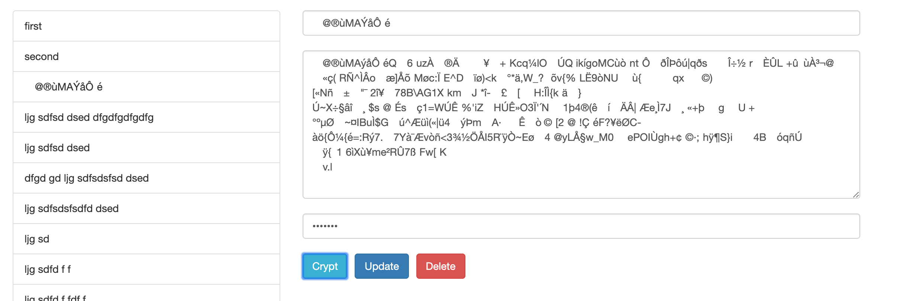
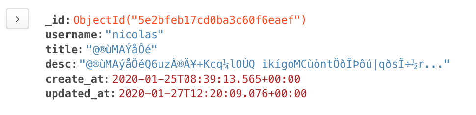

# Cipher Notes Client
cipher-notes-client in Angular.
This project was generated with Angular version 8.3.22.
[My final presentation](https://docs.google.com/presentation/d/e/2PACX-1vT7LDAHOEfmr62YzzUy5E0YrtO5b8IT6GJoXx6e-aDqre404zw_A5ftpOzqdq-eS9eey4i1FfX8O3WW/pub?start=false&loop=false&delayms=3000&slide=id.p)

## Screenshots

### Login Screen

## Create a note

## After Encryption

## Encrypted note sample document in the mongodb

